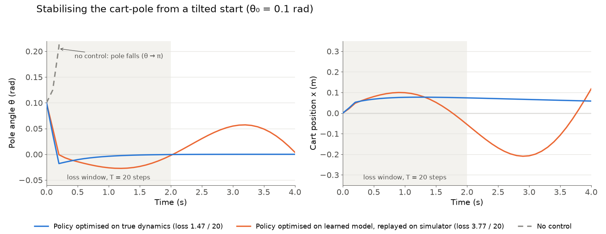
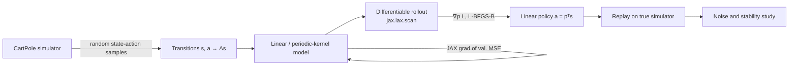

# Learning to Balance: Learned Dynamics and Policy Search for the Cart-Pole

Learn the dynamics of an inverted pendulum from simulated transitions, then optimise a feedback controller by differentiating through the learned model, and test how it holds up under noise.

<p align="center">
  
  <br><em>From a 0.1 rad tilt, a linear policy optimised through the differentiable simulator returns the pole to upright (loss 1.47 / 20) and holds it. A policy optimised only inside the learned kernel model, replayed on the simulator, keeps the pole within 0.06 rad after the first step but oscillates slowly (loss 3.77 / 20). Without control the pole falls.</em>
</p>

## Overview

Model-based control only works if the model is good where the controller takes the system. This project asks a concrete version of that question on the cart-pole, a nonlinear system with an unstable upright equilibrium: **can a controller optimised entirely inside a model learned from data balance the real system, and how much does noise in the data or the dynamics erode it?**

The pipeline builds up from linear least squares, to periodic-kernel regression with hyperparameters tuned by JAX autodiff, to gradient-based policy search through differentiable rollouts of both the true simulator and the learned model. It finishes with a robustness study under observation noise and stochastic dynamics.

## Highlights

- **Stabilisation from a tilted start.** On the simulator, a linear policy optimised by L-BFGS through a differentiable 20-step rollout brings the pole from $\theta_0 = 0.1$ rad to upright with a cumulative loss of **1.47 out of a maximum 20**, and **1.44 / 20** from a perturbed start of all four states.
- **The simulator itself is differentiable.** The 50-substep semi-implicit Euler integrator is re-implemented in JAX (`jax.lax.scan`), so exact policy gradients come from autodiff instead of finite differences.
- **Angles handled correctly.** The kernel treats $\theta$ as periodic, either through a $\sin\!\big((\theta-\theta')/2\big)$ distance or through $(\sin\theta, \cos\theta)$ features, so the model does not break at the $\pm\pi$ wrap-around.
- **Hyperparameters by gradient descent.** Per-dimension lengthscales and the ridge penalty $\lambda$ are learned by differentiating validation MSE through the closed-form kernel solve.
- **Robustness study.** Kernel models are refitted at 7 observation-noise levels ($\sigma \in [0.01, 0.5]$); the optimised policies are then stress-tested over 20 stochastic trials × 6 process-noise levels × 100 steps, with failure rate recorded as $|\theta_T| > 0.5$ rad.

| Initial state $(x, \dot x, \theta, \dot\theta)$ | Optimised gains $p$ | Loss (T = 20, max 20) |
|---|---|---|
| $(0, 0, 0.1, 0)$, tilted | $[0.46,\ 3.97,\ 34.07,\ 4.79]$ | **1.47** |
| $(0.08, -0.13, 0.09, 0.17)$, perturbed | $[1.18,\ 4.71,\ 34.94,\ 5.06]$ | **1.44** |
| $(0, 0, \pi, 0)$, hanging down | $[0,\ 0,\ 0,\ 0]$ | 20.0 |

The hanging-down case is the informative failure. The loss is saturated, so its gradient vanishes and a linear feedback law cannot learn a swing-up. That is why the controller is posed as local stabilisation about the upright equilibrium. (Values recorded in `experiments/policy_search/optimise_policy.py`. Re-running it with current JAX reproduces the tilted and hanging-down rows; for the perturbed start, L-BFGS from zero gains now settles in a worse local minimum (loss 2.86), although the recorded gains above still score 1.445 under the current code.)

## Method

**System.** The state is $s = (x, \dot x, \theta, \dot\theta)$, with $\theta = 0$ upright. One step applies a force $F = F_{\max}\tanh(a / F_{\max})$ ($F_{\max} = 20$) for $\Delta t = 0.1$ s, integrated in 50 semi-implicit Euler substeps with cart and pole friction.

**Dynamics models.** Each model predicts the state increment $\Delta s = s_{t+1} - s_t$ from $z = (s, a)$:

- *Linear:* $\Delta s = C z$, fitted by least squares, with a $(\sin\theta, \cos\theta)$ feature variant.
- *Kernel:* $\Delta s = \sum_{m=1}^{M} \alpha_m\, k(z, z_m)$ with $k(z,z') = \exp\!\big(-\tfrac12 \sum_d (z_d - z'_d)^2 / \ell_d^2\big)$. Basis centres are random training points or $k$-means centroids ($M = 200$), and the weights come from ridge regression, $\alpha = (K^\top K + \lambda I)^{-1} K^\top Y$. The lengthscales $\ell$ and $\lambda$ are optimised in log-space with L-BFGS-B, using JAX gradients of validation MSE.

**Policy search.** The policy is linear, $a = p^\top s$, and is scored by a saturating trajectory loss

$$\mathcal{L}(p) = \sum_{t=1}^{T} \Big[1 - \exp\!\big(-\tfrac12 \textstyle\sum_i s_{t,i}^2 / \sigma_i^2\big)\Big], \qquad \sigma = (0.5,\ 0.4,\ 0.05,\ 0.25).$$

$\nabla_p \mathcal{L}$ is obtained by autodiff through the rollout (`jax.lax.scan`) and minimised with L-BFGS-B. The rollout runs on either the true dynamics or the learned kernel model. A policy found on the model is then replayed on the real simulator to measure the gap between model and reality.



**Robustness.** Gaussian noise is added to the training targets to probe how model error propagates into the policy. Separately, process noise is injected into each state increment during closed-loop rollouts to measure the mean loss, trajectory spread and failure rate of each policy.

## Repository structure

```
cartpole/
  CartPole.py        # reference simulator (semi-implicit Euler, friction, force saturation)
  jax_dynamics.py    # differentiable JAX port + scan-based rollout
  kernels.py         # periodic Gaussian kernel, ridge fit and predict
  data.py            # random state(-action) transition sampling (+ noisy variant)
  simulation.py      # simulator, linear-model and kernel-model rollouts
  scanning.py        # 1-D / 2-D state scans, model vs. truth
  plotting.py        # time series, phase portraits, scan and slice plots
experiments/
  linear_model/      # simulation, state scans, linear regression, model rollouts
  kernel_model/      # kernel regression, convergence in N and M, JAX hyperparameter optimisation
  policy_search/     # action-conditioned model, loss landscapes, policy optimisation
  robustness/        # observation-noise study, noisy dynamics, policy stability
tests/               # pytest suite for simulator, rollouts and scans
```

## Reproducing

Run everything from the repository root. Each script writes to `data/`, `models/` and `figures/`, and later stages load earlier outputs.

```bash
uv venv && uv pip install -r requirements.txt
uv run python -m pytest                                              # simulator and scan tests

uv run python -m experiments.linear_model.dataset                    # 500 random transitions
uv run python -m experiments.linear_model.regression                 # linear model
uv run python -m experiments.kernel_model.convergence                # kernel error vs N and M
uv run python -m experiments.kernel_model.sincos_jax_regression      # sin/cos kernel model, JAX-tuned

uv run python -m experiments.policy_search.dataset                   # 50,000 state-action transitions
uv run python -m experiments.policy_search.action_model              # action-conditioned kernel model
uv run python -m experiments.policy_search.optimise_policy           # policy search on the true dynamics
uv run python -m experiments.policy_search.optimise_on_action_model  # policy search on the learned model

uv run python -m experiments.robustness.observation_noise.noise_impact_study
```

## Tech stack

Python · JAX (autodiff, `jit`, `vmap`, `lax.scan`) · NumPy · SciPy (L-BFGS-B) · scikit-learn (k-means) · Matplotlib · pytest

## Acknowledgements

Originally developed for SF3 Machine Learning, Department of Engineering, University of Cambridge, supervised by José Miguel Hernández-Lobato and Carl E. Rasmussen. The reference simulator in `cartpole/CartPole.py` is derived from the python-rl / PyBrain cart-pole implementation (see its file header).

## Licence

[MIT](LICENSE)
